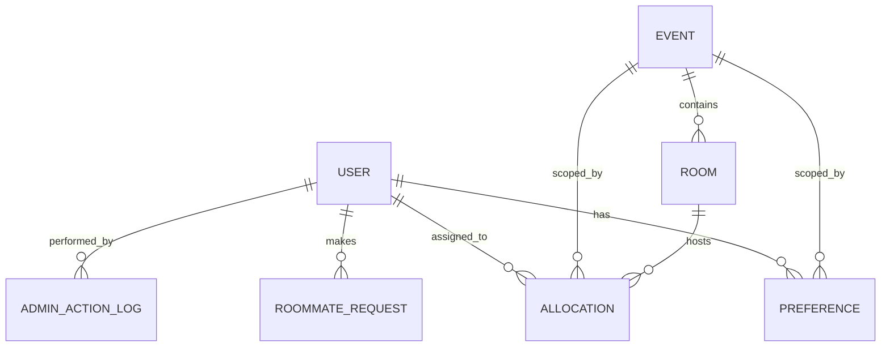
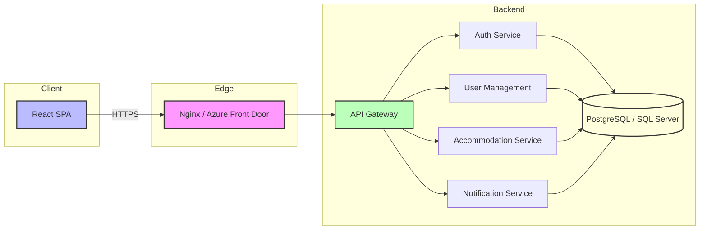

# DESIGN.md

## Component Interfaces

| Component | Interface | Description |
|-----------|-----------|-------------|
| **Frontend (SPA)** | `GET /api/**` \| `POST /api/**` | Calls backend REST API over HTTPS. Uses JWT Bearer token for auth. |
| **API Gateway / Nginx** | HTTP reverse‑proxy | Terminates TLS, routes `/api/*` to `backend` service, serves static SPA assets. |
| **Auth Service** | `POST /auth/login` → JWT<br>`POST /auth/refresh` → new JWT | Implements OAuth2/OIDC flow with Azure AD. Issues short‑lived access token and refresh token. |
| **User Management Service** | `GET /users/{id}`<br>`POST /users`<br>`PUT /users/{id}`<br>`DELETE /users/{id}` | CRUD for employee profiles. Enforces role‑based access (Employee vs Admin). |
| **Accommodation Service** | `GET /accommodations/events/{eventId}`<br>`POST /accommodations/requests`<br>`PUT /accommodations/requests/{id}` | Handles roommate request creation, acceptance, cancellation and retrieval. |
| **Notification Service** | Internal pub/sub (Azure Service Bus) or direct HTTP calls | Sends email/Teams notifications on request status changes, allocation results. |
| **Data Layer** | PostgreSQL / SQL Server (via ORM) | Exposes data models; accessed by backend services through repository pattern. |

## API Contracts

### Auth Service
```http
POST /auth/login
Content-Type: application/json

{ "provider": "azure", "id_token": "<id_token>" }
```
*Response* (200): `{ "access_token": "<jwt>", "refresh_token": "<jwt>" }`

### User Management
```http
GET /api/users/{id}
Authorization: Bearer <access_token>
```
*Response* (200):
```json
{
  "id": "uuid",
  "email": "user@example.com",
  "full_name": "John Doe",
  "department": "Engineering",
  "gender": "Male",
  "role": "Employee"
}
```
... (similar for POST/PUT/DELETE – request/response schemas defined in `docs/openapi.yaml`).

### Accommodation Service
#### Create Roommate Request
```http
POST /api/accommodations/requests
Authorization: Bearer <jwt>
Content-Type: application/json

{ "event_id": "uuid", "target_user_id": "uuid" }
```
*Response* (201): `{ "request_id": "uuid", "status": "Pending" }`

#### Accept Request
```http
PUT /api/accommodations/requests/{id}/accept
Authorization: Bearer <jwt>
```
*Response* (200): `{ "status": "Accepted", "locked_at": "2026-06-11T00:00:00Z" }`

### Allocation Endpoint (Admin)
```http
POST /api/accommodations/allocate
Authorization: Bearer <jwt> (Admin only)
Content-Type: application/json

{ "event_id": "uuid" }
```
*Response* (202): `{ "job_id": "uuid", "status": "Started" }`

## Data Models (Entity‑Relationship)



### Table Definitions (PostgreSQL syntax)
```sql
CREATE TABLE "user" (
    id UUID PRIMARY KEY,
    email VARCHAR(255) NOT NULL UNIQUE,
    full_name VARCHAR(255) NOT NULL,
    department VARCHAR(255),
    gender VARCHAR(20) CHECK (gender IN ('Male','Female','Other')),
    role VARCHAR(20) CHECK (role IN ('Employee','Admin'))
);

CREATE TABLE event (
    id UUID PRIMARY KEY,
    name VARCHAR(255) NOT NULL,
    start_date DATE NOT NULL,
    end_date DATE NOT NULL,
    location VARCHAR(255)
);

CREATE TABLE preference (
    id UUID PRIMARY KEY,
    user_id UUID REFERENCES "user"(id),
    event_id UUID REFERENCES event(id),
    preferred_room_type VARCHAR(50),
    roommate_gender_preference VARCHAR(20),
    notes TEXT
);

CREATE TABLE room (
    id UUID PRIMARY KEY,
    event_id UUID REFERENCES event(id),
    room_number VARCHAR(20),
    capacity INT CHECK (capacity > 0),
    room_type VARCHAR(50),
    gender_allowed VARCHAR(20) CHECK (gender_allowed IN ('Male','Female','Any'))
);

CREATE TABLE roommate_request (
    id UUID PRIMARY KEY,
    requester_id UUID REFERENCES "user"(id),
    target_id UUID REFERENCES "user"(id),
    event_id UUID REFERENCES event(id),
    status VARCHAR(20) CHECK (status IN ('Pending','Accepted','Rejected','Cancelled')),
    locked_at TIMESTAMPTZ
);

CREATE TABLE allocation (
    id UUID PRIMARY KEY,
    user_id UUID REFERENCES "user"(id),
    room_id UUID REFERENCES room(id),
    event_id UUID REFERENCES event(id),
    assigned_at TIMESTAMPTZ NOT NULL
);

CREATE TABLE admin_action_log (
    id UUID PRIMARY KEY,
    admin_id UUID REFERENCES "user"(id),
    action_type VARCHAR(50),
    details JSONB,
    timestamp TIMESTAMPTZ DEFAULT now()
);
```

## Deployment Diagram



## Required Configuration

| Component | Config File | Key Settings |
|-----------|-------------|--------------|
| **Frontend** | `frontend/.env` | `REACT_APP_API_URL=https://api.example.com` |
| **Nginx** | `nginx/nginx.conf` | `listen 443 ssl;` `proxy_pass http://backend:8080;` |
| **Auth Service** | `backend/auth/appsettings.json` | Azure AD tenant/client IDs, token lifetimes |
| **Backend** | `backend/appsettings.json` | Connection string to PostgreSQL, JWT validation parameters |
| **Kubernetes** | `k8s/deployment.yaml` | Image tags, replica count, resource limits, env vars |
| **CI/CD** | `.github/workflows/ci.yml` | Build Docker images, push to registry, run helm upgrade |

## Additional Notes
- All services expose OpenAPI specification located at `docs/openapi.yaml`.
- Secrets (client IDs, DB passwords) are stored in Azure Key Vault and injected via environment variables in the deployment pipeline.
- Monitoring is enabled through Azure Application Insights; each service includes instrumentation middleware.

*Prepared by the implementer sub‑agent.*
